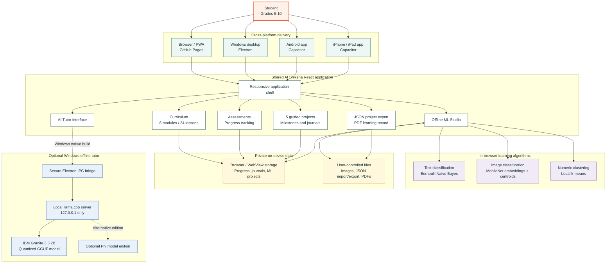
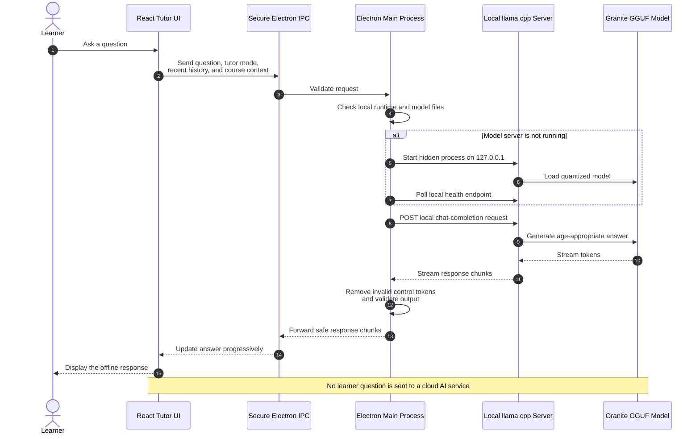
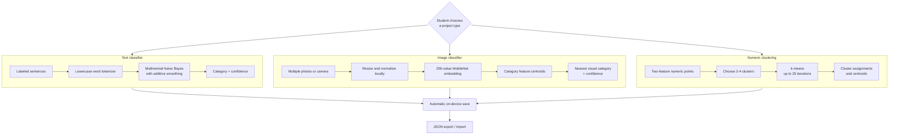
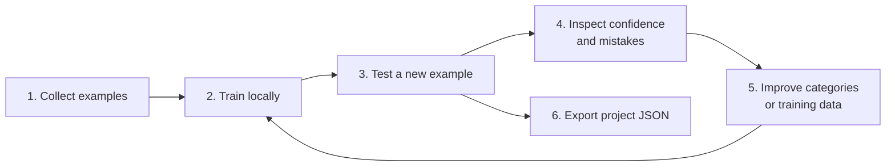
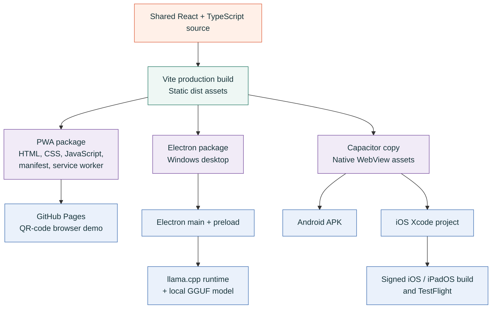
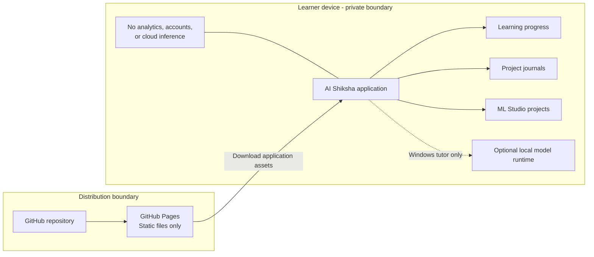

# AI Shiksha Architecture

AI Shiksha is an offline-first educational platform for students in grades 5-10. It combines structured learning content, assessments, guided projects, a hands-on machine-learning studio, and an optional local generative-AI tutor.

This document is designed for hackathon presentations. The Mermaid diagrams render directly on GitHub and can also be exported to SVG or PNG with Mermaid-compatible tools.

## 1. Architecture at a glance



## 2. Core design principles

| Principle | Implementation |
|---|---|
| Offline first | Lessons, assessments, guided projects, progress, and ML Studio work after the application assets are installed or cached. |
| Privacy by design | No learner account, analytics, advertising, or cloud inference is required. Learner data stays in local browser or application storage. |
| One learning experience | React, TypeScript, and Vite provide the shared interface used by browser, Windows, Android, and iOS builds. |
| Learn by building | Students collect examples, train local models, test predictions, improve data, and export their projects. |
| Optional generative AI | The Windows package can run a quantized language model locally through a loopback-only llama.cpp server. |
| Low-connectivity distribution | GitHub Pages and a QR code distribute the PWA and Android hackathon build; continued learning does not require cloud services. |
| Progressive packaging | The lightweight course and ML Studio are separate from the multi-gigabyte tutor model content pack. |

## 3. Shared application layers

```mermaid
flowchart LR
    subgraph Presentation["Presentation layer"]
        React["React 19 components"]
        Responsive["Responsive desktop, tablet,<br/>iPad, and mobile layouts"]
        Icons["Accessible controls<br/>Lucide icons"]
    end

    subgraph LearningLayer["Learning experience"]
        Courses["Curriculum and lessons"]
        Quiz["Assessments"]
        Guided["Guided projects and journals"]
        Progress["Progress dashboard"]
        Coach["Tutor modes<br/>Learn / Homework / Project / Quiz"]
    end

    subgraph Intelligence["Local intelligence"]
        NB["Bernoulli Naive Bayes"]
        Centroid["MobileNet visual embeddings"]
        KMeans["k-means clustering"]
        LLM["Optional local LLM adapter"]
    end

    subgraph Persistence["Persistence and portability"]
        Storage["localStorage / WebView storage"]
        JSON["ML project JSON"]
        PDF["Learning-record PDF"]
        Photos["Camera / photo library"]
    end

    Presentation --> LearningLayer
    LearningLayer --> Intelligence
    LearningLayer --> Persistence
    Intelligence --> Persistence
```



### Technology stack

| Area | Technology |
|---|---|
| User interface | React 19, TypeScript, CSS |
| Build system | Vite |
| PWA | Service worker and web app manifest through `vite-plugin-pwa` |
| Windows | Electron and Electron Builder |
| Android / iOS | Capacitor native containers |
| Local tutor runtime | llama.cpp-compatible local server |
| Default desktop model | IBM Granite 3.3 2B Instruct, Q4_K_M GGUF |
| ML Studio | Browser-native TypeScript algorithms and Canvas image processing |
| Documents | jsPDF and JSON export/import |
| Public distribution | GitHub Pages and GitHub Actions |

## 4. Offline AI tutor request flow

The generative tutor is a native desktop capability. The browser demo remains lightweight and does not download or call a cloud model.



### Tutor safety and reliability controls

- Questions are validated before they reach the model.
- Only approved tutor modes are accepted.
- Recent history and verified course context are size-limited.
- The model listens only on the device loopback address.
- Electron uses context isolation, disables Node.js in the renderer, and enables sandboxing.
- Internal model tokens and invalid prompt fragments are removed before display.
- Responses use a focused educational system prompt with age-appropriate behavior.
- Errors are shown explicitly when the runtime or model content pack is missing.

## 5. Offline ML Studio architecture

ML Studio is independent of the large generative-AI model. It runs directly in the browser, Electron renderer, or Capacitor WebView.



### ML Studio learning cycle



### What is stored for each ML project

- Editable project title and project type.
- Category names and colors.
- Text examples, compressed image thumbnails, or numeric points.
- Compressed thumbnails and compact MobileNet feature vectors rather than
  original full-resolution photos.
- Training signature, cluster assignments, and centroids when applicable.
- Last-updated timestamp.

The data is stored under the local key `shiksha-ml-studio-v1`. Students can export a JSON backup and import it on another device.

## 6. Cross-platform packaging



### Platform capability matrix

| Capability | Browser / PWA | Windows | Android | iOS / iPadOS |
|---|---:|---:|---:|---:|
| Curriculum and lessons | Yes | Yes | Yes | Yes |
| Assessments and progress | Yes | Yes | Yes | Yes |
| Guided projects and journals | Yes | Yes | Yes | Yes |
| Offline ML Studio | Yes | Yes | Yes | Yes |
| Multi-photo training | Yes | Yes | Yes | Yes |
| JSON project portability | Yes | Yes | Yes | Yes |
| PDF learning record | Yes | Yes | Yes | Yes |
| Offline generative tutor | No | Yes, with model pack | Planned with device model pack | Planned with device model pack |
| Distribution | QR / URL | Installer or folder package | APK / future Play Store | TestFlight / future App Store |

## 7. GitHub Pages and QR distribution

GitHub is used to distribute the hackathon demo, not to process learner data.

```mermaid
sequenceDiagram
    actor Team as AI Shiksha Team
    participant Repo as GitHub Repository
    participant Actions as GitHub Actions
    participant Pages as GitHub Pages
    participant QR as Hackathon QR Code
    actor Learner
    participant Device as Learner Device

    Team->>Repo: Push PWA, landing page,<br/>privacy notice, and APK
    Repo->>Actions: Trigger deployment on main
    Actions->>Pages: Publish site directory
    Team->>QR: Encode demo-page URL
    Learner->>QR: Scan code
    QR->>Pages: Open landing page
    Learner->>Device: Start PWA or download APK
    Device->>Device: Store progress and projects locally

    Note over Pages,Device: GitHub distributes static files;<br/>it does not run the tutor or store learning records
```

## 8. Privacy and trust boundaries



### Privacy summary for judges

- The public site serves static application files and the Android demo package.
- There is no learner login or central learner database.
- Progress, journals, and ML projects stay on the learner's device.
- The Windows AI tutor runs on the same computer as the student.
- ML Studio images are reduced to thumbnails and compact feature vectors for local storage.
- Students control exported JSON projects and PDF learning records.

## 9. Current hackathon deployment

```text
GitHub repository
└── site/
    ├── demo.html                  QR landing page
    ├── privacy.html               Privacy notice
    ├── index.html                 PWA entry point
    ├── assets/                    Compiled React application
    ├── manifest.webmanifest       Installable PWA metadata
    ├── sw.js                      Offline service worker
    ├── qr-code.png                Hackathon QR code
    └── downloads/
        └── ShikshaAI-Android-Demo.apk
```

Target QR URL:

```text
https://officialsunilng-coder.github.io/ai-shiksha/demo.html
```

## 10. Recommended single-slide diagram

For one presentation slide, use the first **Architecture at a glance** diagram and emphasize these three messages:

1. **One shared learning application** runs across browser, Windows, Android, and iPad/iOS.
2. **Learning data and machine learning stay on the device**, supporting privacy and low-connectivity environments.
3. **The large generative tutor is optional and modular**, so the core learning experience stays lightweight.

Suggested slide title:

> **AI Shiksha: Private, Offline AI Learning Across Every Student Device**

Suggested 20-second explanation:

> AI Shiksha uses one shared React learning experience across web, Windows, Android, and iPad. Curriculum, assessments, projects, progress, and the hands-on ML Studio all work locally and keep student data on the device. On Windows, an optional quantized Granite model adds a fully offline AI tutor through a secure local runtime, while GitHub Pages and a QR code provide simple hackathon distribution.

## 11. ChatGPT image-generation prompt

Copy the prompt below into an image-capable ChatGPT conversation:

```text
Create a clean, professional 16:9 system architecture infographic for a hackathon presentation titled:
"AI Shiksha - Private, Offline AI Learning Across Every Student Device"

Visual style:
- Modern educational technology infographic
- White or warm off-white background
- Dark teal headings
- Orange, green, purple, and blue accent colors
- Rounded cards, thin connector arrows, subtle shadows
- Minimal text, large readable labels
- Friendly but technically credible
- No stock-photo people and no decorative clutter
- Use simple vector icons for browser, Windows laptop, Android phone, iPad, books, quiz, projects, machine learning, local storage, and AI model

Arrange the diagram in four horizontal layers:

Layer 1 - Learner devices:
- Browser / PWA
- Windows Desktop
- Android
- iPhone / iPad
- Show all four feeding into one shared platform

Layer 2 - Shared AI Shiksha application:
- Curriculum: 6 modules and 24 lessons
- Assessments and progress
- 5 guided projects and project journals
- Offline ML Studio
- AI Tutor interface
- JSON and PDF export
- Label the implementation: React + TypeScript + Vite

Layer 3 - On-device intelligence and data:
- Text classifier: Multinomial Naive Bayes
- Image classifier: MobileNet visual embeddings and category centroids
- Numeric clustering: k-means
- Private local storage: progress, journals, and ML projects
- Camera / photo library and local files
- Place a shield icon around this layer and label it:
  "Private on-device processing - no learner account, analytics, or cloud inference"

Layer 4 - Optional desktop AI tutor:
- Secure Electron IPC
- Local llama.cpp server on 127.0.0.1
- IBM Granite 3.3 2B quantized GGUF model
- Show streamed answers returning to the Tutor UI
- Label this path "Windows offline tutor - optional model content pack"

Add a small distribution area on the right:
- GitHub repository
- GitHub Actions
- GitHub Pages
- QR code
- PWA and Android APK download
- Clearly state: "GitHub distributes static files only; learner data remains on the device"

Use solid arrows for currently implemented data flows.
Use dashed arrows for optional or planned mobile local-LLM support.
Do not imply that GitHub or any cloud service receives student questions, progress, photos, journals, or ML training data.
Keep every label spelled exactly as provided.
```

## 12. Optional three-slide presentation structure

### Slide 1 - The problem and solution

- Many learners have unreliable connectivity or limited access to cloud AI.
- AI Shiksha brings structured AI education and hands-on experimentation to the device.
- QR distribution makes hackathon testing simple.

### Slide 2 - Technical architecture

- Use the **Architecture at a glance** diagram.
- Highlight the shared React application, local ML Studio, local storage, and optional Granite tutor.

### Slide 3 - Privacy, reach, and roadmap

- No account, analytics, advertising, or cloud inference.
- Browser, Windows, Android, and iPad/iOS interfaces.
- Next steps: production Android signing, native iOS/TestFlight release, and optimized mobile model content packs.
